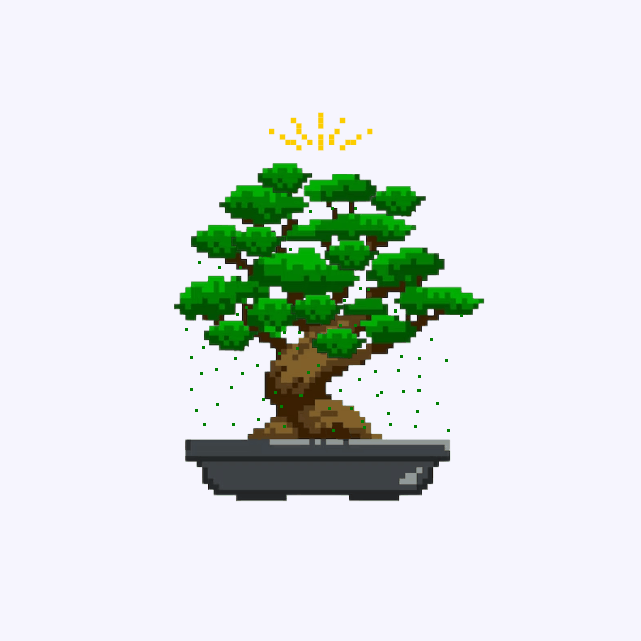

# 🌱 MindGarden: Your AI-Powered Mental Wellness Companion

### 👥 Team Members
- **Elhan Mahmutović**
- **Mirza Abdulahović**
- **Vedad Kruho**
- **Mustafa Sinanović**
- **Belmir Grahić**

## 🌿 Overview
MindGarden is a cutting-edge mental wellness platform that combines **AI-powered chat support** and a **gamified reward system** to help users maintain their psychological well-being through **daily check-ins**. By offering a unique, visual representation of personal growth, MindGarden transforms mental self-care into an **engaging and rewarding journey**.

## 🎯 Goals

- ✅ **Encourage Consistency** – Establishing a **daily mental health check-in routine** is crucial for long-term improvement. MindGarden tracks user activity to reinforce this habit.
- ✅ **Motivate Through Gamification** – **Achievements, streaks, and progress tracking** help sustain user engagement, providing an intuitive and visually appealing experience.
- ✅ **Leverage Positive Reinforcement** – **Dopamine and endorphin-releasing achievements** make users feel rewarded, fostering long-term mental wellness habits.
- ✅ **Support Personal Growth** – A **growing bonsai tree** represents a user’s mental health journey, reinforcing mindfulness, perseverance, and achievement.

## 🌟 Why MindGarden? 

🚀 Mental health improvement is a **long-term journey**, often overlooked in today’s fast-paced digital world. MindGarden simplifies self-care with an **intuitive and engaging experience**, avoiding passive scrolling and promoting meaningful interaction.

🌸 The **Japanese bonsai tree** serves as a powerful visual motivator, offering a **sense of tranquility and accomplishment** as users progress in their wellness journey.

## 🌳 Tree of Mindfulness Progression:
| Level 1 | Level 2 | Level 3 | Level 4 |
|---------|---------|---------|---------|
|  |  |  |  |

## 💻 Tech Stack & Implementation  

### 🎨 Frontend  
Built with **Next.js** for fast performance and SEO optimization, styled using **Tailwind CSS** and **Shadcn UI** for a modern, responsive design. **TypeScript** ensures maintainability and type safety, while **Zustand** provides lightweight state management. Data fetching is handled efficiently with **React Query**, and authentication is secured using **NextAuth.js** with a **PostgreSQL adapter**.  

### 🛠️ Backend  
Powered by **Express.js** for robust API handling and business logic, with **PostgreSQL** managing user data, check-ins, and AI interactions. **TypeORM** ensures structured database management, and **TypeScript** enhances reliability and clarity. Integrated **OpenAI API** enables an intelligent chatbot for mental wellness support.  

Sure! Here's a refined and more polished version of your paragraph with **Terraform** included:

### ☁️ Infrastructure & Deployment

Deployed on **AWS** for scalable compute and managed database resources. **Docker** containers ensure consistency across environments, streamlining both development and deployment. Infrastructure is provisioned and managed using **Terraform**, enabling repeatable, version-controlled infrastructure as code. **GoDaddy** and AWS-managed IPs are used for domain and IP management. **Husky** enforces code quality through pre-commit hooks. **Nginx** acts as a reverse proxy, efficiently routing requests to the appropriate services.

## 🎉 Join the MindGarden Movement!
MindGarden makes mental self-care **simple, engaging, and rewarding**. Let's cultivate a **happier, healthier mind**—one check-in at a time. 🌱💙