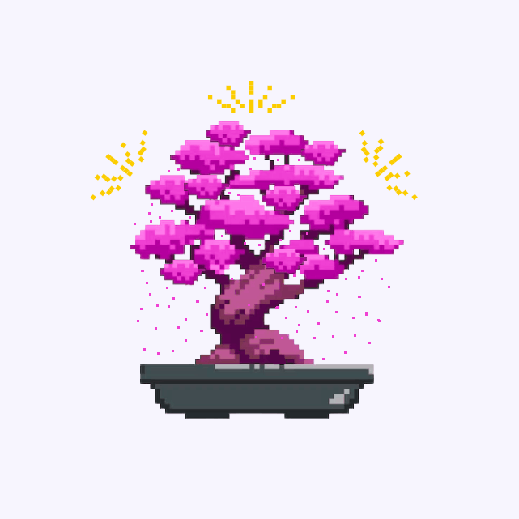

# 🌱 MindGarden: Your AI-Powered Mental Wellness Companion

### 👥 Team Members
- **Elhan Mahmutović**
- **Mirza Abdulahović**
- **Vedad Kruho**
- **Mustafa Sinanović**
- **Belmir Grahić**

## 🌿 Overview
MindGarden is a cutting-edge mental wellness platform that combines **AI-powered chat support** and a **gamified reward system** to help users maintain their psychological well-being through **daily check-ins**. By offering a unique, visual representation of personal growth, MindGarden transforms mental self-care into an **engaging and rewarding journey**.

## 🎯 Goals

- ✅ **Encourage Consistency** – Establishing a **daily mental health check-in routine** is crucial for long-term improvement. MindGarden tracks user activity to reinforce this habit.
- ✅ **Motivate Through Gamification** – **Achievements, streaks, and progress tracking** help sustain user engagement, providing an intuitive and visually appealing experience.
- ✅ **Leverage Positive Reinforcement** – **Dopamine and endorphin-releasing achievements** make users feel rewarded, fostering long-term mental wellness habits.
- ✅ **Support Personal Growth** – A **growing bonsai tree** represents a user’s mental health journey, reinforcing mindfulness, perseverance, and achievement.

## 🌟 Why MindGarden?

🚀 Mental health improvement is a **long-term journey**, often overlooked in today’s fast-paced digital world. MindGarden simplifies self-care with an **intuitive and engaging experience**, avoiding passive scrolling and promoting meaningful interaction.

🌸 The **Japanese bonsai tree** serves as a powerful visual motivator, offering a **sense of tranquility and accomplishment** as users progress in their wellness journey.

## 🌳 Tree of Mindfulness Progression:
| Level 1 | Level 2 | Level 3 | Level 4 |
|---------|---------|---------|---------|
|  |  |  |  |

## 🎉 Join the MindGarden Movement!
MindGarden makes mental self-care **simple, engaging, and rewarding**. Let’s cultivate a **happier, healthier mind**—one check-in at a time. 🌱💙